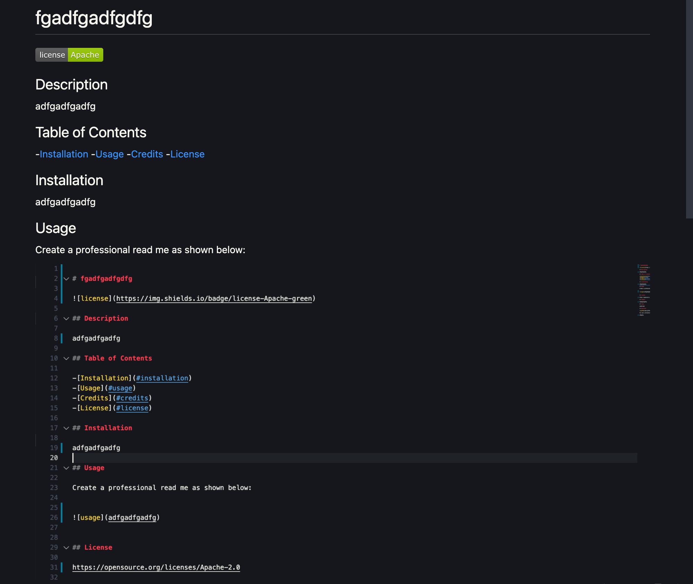

# Professional README Generator 

## Video

## Description

I wanted to create a Professional README generator so I and other users could save time by answering a few simple questions about there project in just minutes.

## Table of Contents

-[Installation](#installation)
-[Usage](#usage)
-[Credits](#credits)
-[License](#license)

## Installation

Must have node.js installed on your computer. You can install this in your terminal by running npm i to install. Once installed you should now see a package.json file in your folder.

## Usage

Create a professional read me as shown below:

## Questions

[gitHub](https://github.com/JosieMald)

For more information regarding this generator you can contact me at:

JosieLindaMaldonado@gmail.com
